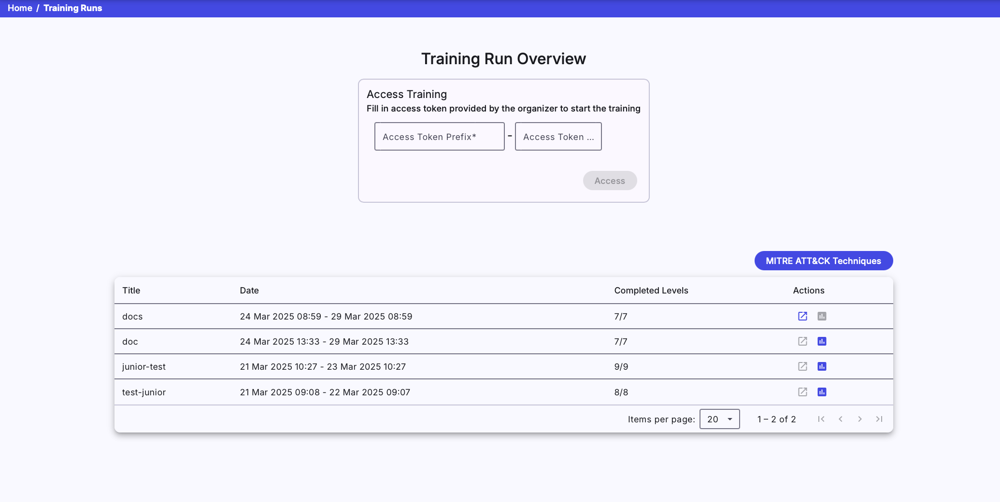
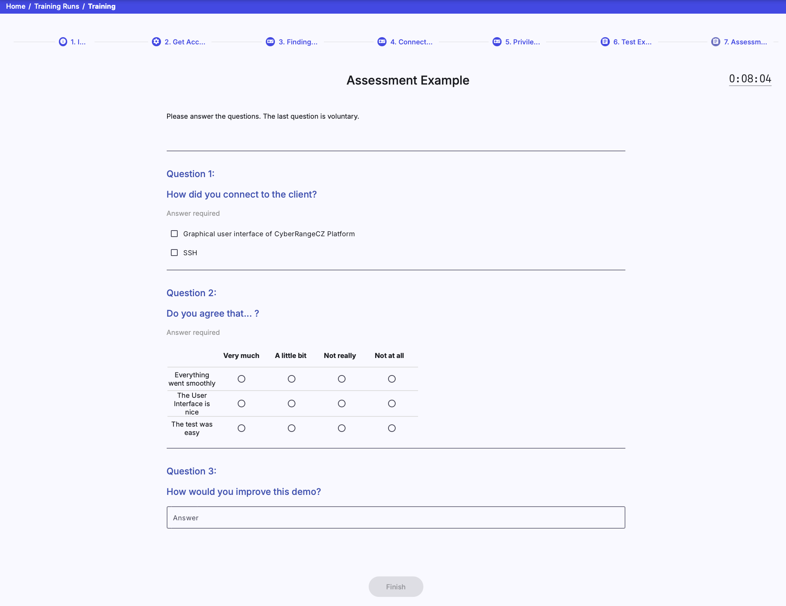
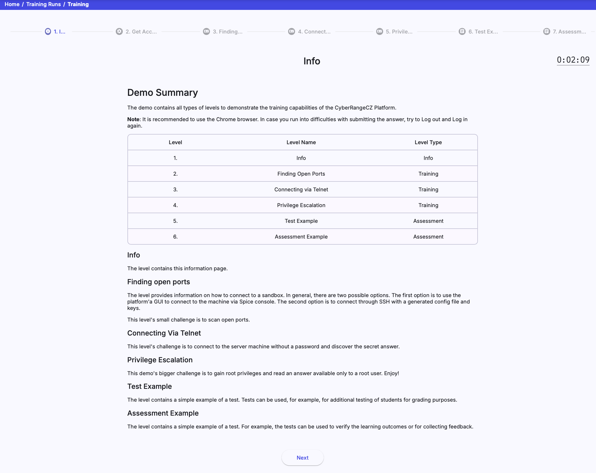
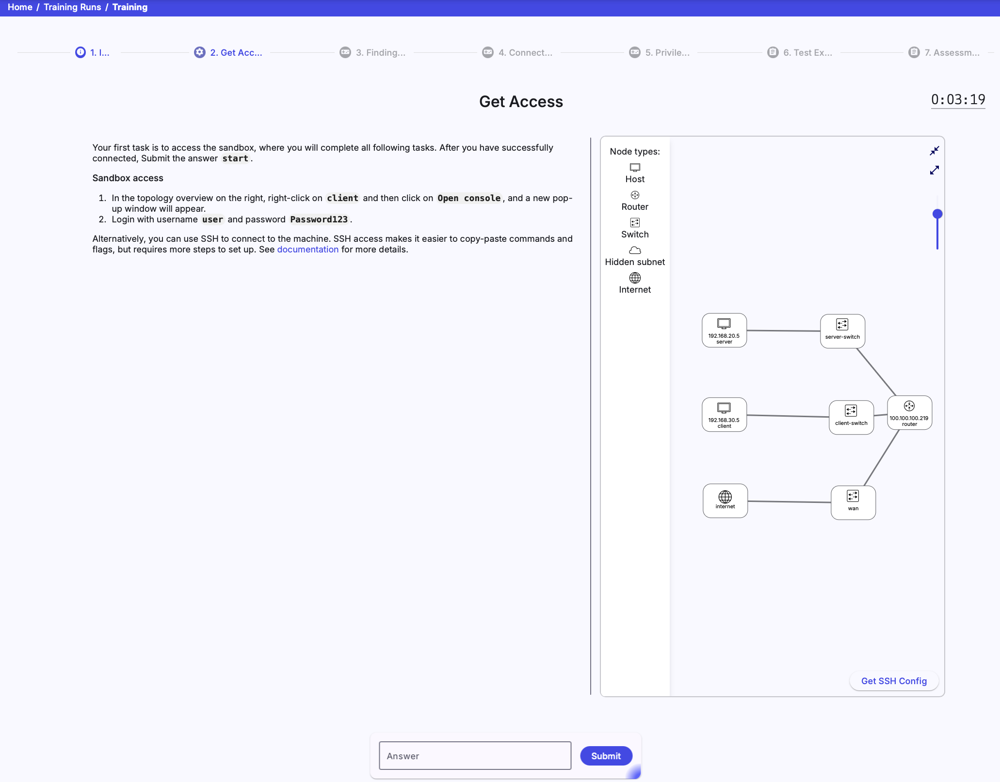
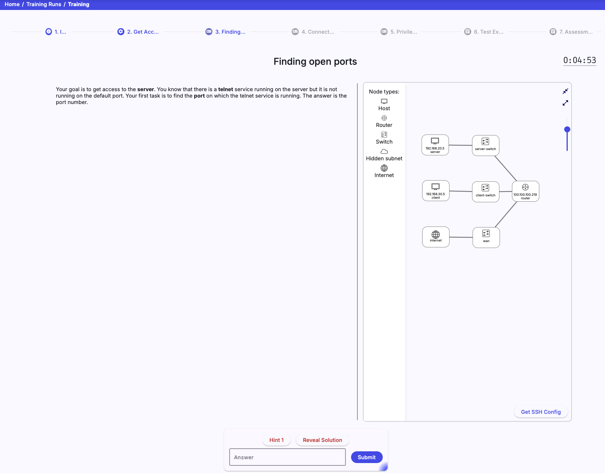
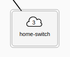
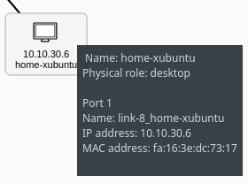
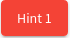
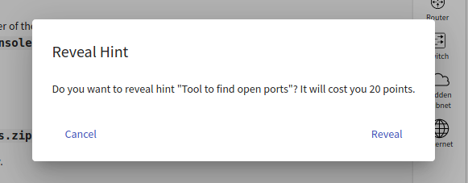
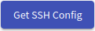

## Training Runs Overview
The page consists of a panel providing [access to training](#1-access-training) and a list of [training runs](#2-training-runs).

  

### 1. Access Training
Enter the access token prefix and PIN provided by the instructor of the training instance into the two fields shown in the above figure. By clicking on the  button, the system checks if there are any active training instances with a corresponding access token and any available sandboxes. If those conditions are fulfilled, the trainee will access the training run (particular training) with an assigned unique sandbox.

!!! note
    If a trainee has already accessed a training run in a particular training instance and hasn't finished it yet, the training run will be resumed. 

### 2. Training Runs
It lists all training runs of the logged-in trainee. Each table row represents a training run of a particular training instance (trainee can access multiple training runs within training instance). The training run can be unfinished or finished. An unfinished run can be resumed using the :material-launch:{: .blue .icon} button or entering the access token in the Access Training panel.
A trainee can view the results of the finished training run by clicking the :material-poll-box:{: .blue .icon} button.

## Training Run

In the training run, trainees will go through predesigned levels. There is a bar listing all of the levels in order at the top of the training run page. Visited levels are highlighted in blue :material-checkbox-blank-circle:{: .blue .icon}, the currently selected level is highlighted in pink :material-checkbox-blank-circle:{: .pink .icon}, and non-visited are in grey :material-checkbox-blank-circle:{: .grey .icon}. If backward mode is enabled by an instructor, a trainee can move between visited levels by clicking the level in the bar. In the current version, there are four types of levels available ([Assessment](#1-assessment-level), [Info](#2-info-level), [Access](#3-access-level), and [Training](#4-training-level)).

### 1. Assessment Level 
At the assessment level, a trainee must answer the different types of questions. Assessment can be a questionnaire or test. If it is a test, the trainee should try his best to get the best score because questions are scored. Some of the questions can be required and must be answered to proceed to the next level. 

There are three types of questions: 

* **Free Form Question (FFQ)**: Trainees are asked to provide the text answer to the predefined field. 
* **Multiple Choice Questions (MCQ)**: Trainees are asked to select only correct answers from the choices offered as a list.
* **Extended matching item (EMI)**: Trainees are asked to pair rows and columns.

  

### 2. Info Level
The info level provides important information to trainees in text form.

  

### 3. Access Level
The access level provides information to trainees on how to access cloud or local sandbox.

  

### 4. Training Level 
The trainee must complete the assignment specified on the page's left side at the training level. On the right side, the sandbox topology supplemented by legend is displayed. The layout of the topology can be changed with the controls panel (see the following figure):

  

#### VM Manipulation
Nodes with cloud icons can be expanded. The number inside the cloud indicates the number of nodes that are collapsed.

    

      
    

    

      
    

    

      
    

Right-click on the selected network node (host or router), the following menu will be opened:

  

* **Open console**: Connect to the particular network node's Command Line Interface (CLI) using the Apache Guacamole. When you connect to the Guacamole, you will see the following console in a new browser tab.

    

        
    

* **Open console (deprecated)**: Connect to the web console of the particular network node using SPICE protocol. The feature is provided by OpenStack cloud, and console types may vary. When you connect to the SPICE client, you will see the following console in a new browser tab.
!!! warning
    In the case of local sandboxes, only the last option **Copy host info to clipboard** is available in the menu. 

    

<video width="100%" height="auto" controls>
    <source src="../../../../img/user-guide-basic/training-agenda/training-run/how-to-connect-to-spice.mp4" type="video/mp4">
    Your browser does not support the video tag.
</video>

!!! info
    To scroll console output up, use Shift + Page Up, and to scroll it down, use Shift + Page Down.

* **Open GUI**: Connect to the particular network node's Graphical User Interface (GUI) using the Apache Guacamole. This option might not be visible if the VM does not have GUI configured. When you connect to the Spice client, you will see the following console in a new browser tab. 

    

        
    

!!! warning
    All the above options of connecting to the corresponding VM require correct login credentials.

* **Copy host info to clipboard**: Copy the content of the node tooltip to the clipboard.

   

        
    

#### Hints
If the trainee gets stuck and does not know how to proceed with the task they can use one or more of the provided hints situated inside the control panel at the bottom of the page. Clicking the  button opens the following confirmation window: 

   

The message inside the window contains the name of the hint, which should tell the trainee if it will help them or not. The message also includes the number of points lost if the trainee reveals the hint. 

#### Solution
If hints are not enough, the trainee can reveal the solution by clicking the . Solution reveal will cost the trainee all of the points that could be awarded at the given level.

#### Submit
When the trainee finds out the answer for the current training level, they can proceed to the next level by typing the answer to the input field and submitting it by clicking the  button in the control panel.

#### SSH Access
In addition to connecting to the sandbox using Spice or Guacamole, it is also possible to connect to the sandbox machines locally using SSH. To do that, click the  button and download the ZIP archive with the configuration of a user SSH access to the respective sandbox. More about SSH access can be found in [Sandbox SSH Access](../../../../user-guide-advanced/sandboxes/sandbox-access/#user-access).

## Training Run Results

When the trainee finishes a training run, they will see the visualization of their and the other players' behavior in training. The visualization is described in detail in [Visualizations for Linear Training](../../visualizations/visualizations-for-linear/#for-trainees).
