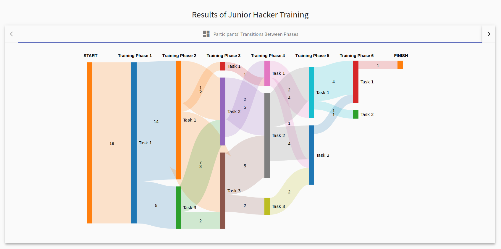

# Visualizations for Adaptive Training

The page displays only one tab with the Sankey diagram. 

#### Sankey Diagram
Diagram represents participant's transitions between the tasks of the respective training phases. Each transition also contains the number of participants. 

  

