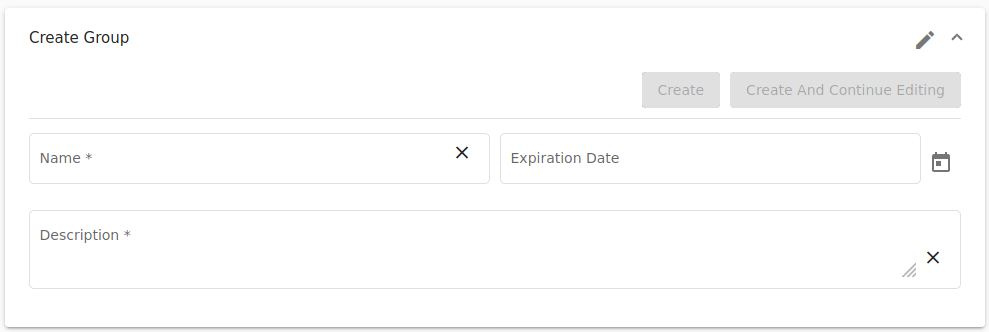

This section is used to list all groups created in the KYPO platform. Groups are essential to the user-access, as the access roles are not assigned to specific users but to groups. The user acquires access to the KYPO portal agendas based on the roles of the groups they belong to.

 

To create a new group, the administrator must click on  button that redirects him to the page [Create Group](#create-or-edit-group). The last column of the table contains actions :material-pencil:{: .icon .blue } &nbsp; :material-delete:{: .red .icon }: 

??? pencil "Edit"
    
    Click the button will redirect to [Edit Group](#create-or-edit-group) page.
    
??? trash-can "Delete"
    
    Click the button, the following confirmation window will be opened: 
    
    

      
    

    
    After confirming, the group will be deleted from the KYPO portal.
    
    !!! info
        Multiple groups can be deleted by checking groups with checkboxes situated on the left side of the table row and by clicking on  button.

## Create or Edit Group

The page consists of three panels:

[1. Create/Edit Group](#1-createedit-group) 
[2. Edit members](#2-edit-members) 
[3. Edit roles](#3-edit-roles) 

!!! note 
    Create Group and Edit Group pages are same but Edit Group page has some fields pre-filled. 

During the creation of a group, the second and third panels are disabled. To make them accessible, the administrator must fill the required fields in the first panel and either click on: 

1.  that will create the new group and redirect the administrator back to the **Group Overview**.
2.  that will stay on the page and allow the administrator to edit **members** and **roles** of the group.

### 1. Create/Edit Group
Here, the administrator is required to fill up all the necessary fields before creating a new group. The `Expiration Date` field is optional and is useful in the cases when the administrator will create a group of instructors, e.g., for a particular semester. After filling up fields, click on the  button to save the group. Then panels **Edit members** and **Edit roles** will be rolled down. 

### 2. Edit Members
Here, the administrator can add users individually or import all users from the group. The part **Add users** provide an easy way to search for users whose administrator would like to add to the group. Administrators can also add all users from the specific group in the part **Import users**. Click on the  button to add selected users to the group. All users will be added to the group and will be present in the list in the part **Members of group**. A user or multiple users can be removed via the common way mentioned before.

### 3. Edit Roles 
Here, the administrator can assign roles to the group. The part **Add roles** provide an easy way to search for roles which the administrator would like to assign to the group. Click on the  button to assign all selected roles to the group. Assigned roles will be present in the list in the part **Roles of group**. A role or multiple roles can be removed via the common way mentioned before.
