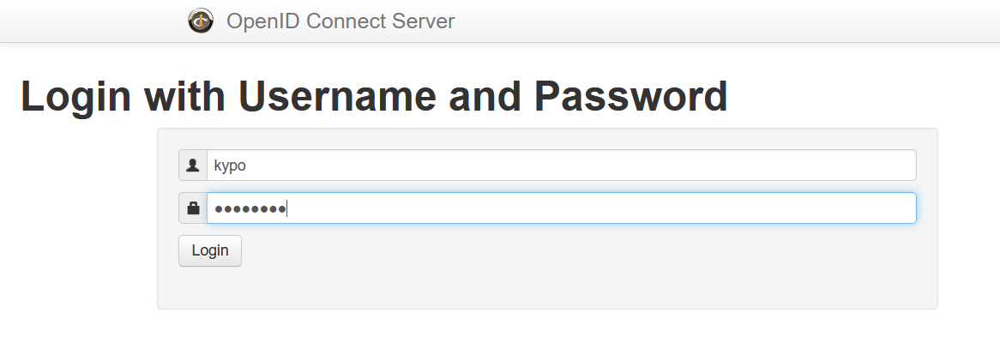
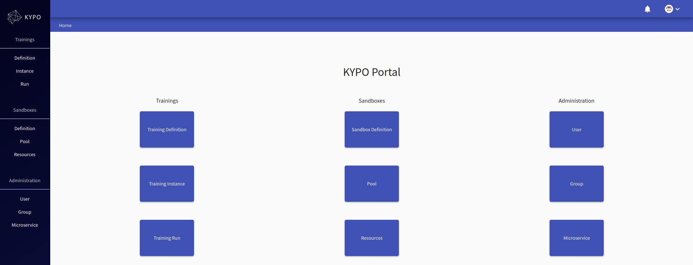

## Login

Access the KYPO Portal via the web browser entering the page address, e.g. [https://hostname.domain.cz](https://hostname.domain.cz). Users can log in to the KYPO CRP using one OIDC provider. There can be more than one, depends on how many OIDC providers you have configured. Any provider which using OpenID Connect specification can be used, e.g. [MUNI Unified Login](https://it.muni.cz/en/services/jednotne-prihlaseni-na-muni/navody/how-to-connect-a-service-to-muni-unified-login). If you don't have OIDC provider you can use the local OIDC provider which is the part of KYPO Platform. In this case users must be registered by the administrator of the KYPO Platform, who will provide username and password to users. If you have more than one OIDC provider, you can select preferable login option.

  

This will redirect you to the selected OIDC provider, in the case of a local OIDC provider, the login page would be as follows: 

After successful login you will be redirected to the main page that should look similar to the following figure:

!!! Note
    Based on the roles you have, some buttons might be disabled. 

## Logout

At the top right corner, open the user menu where is the Logout button. 

  

It will redirect you to the logout confirmation page.

  

After confirmation, you will be redirected to the previously mentioned entry page to login.
