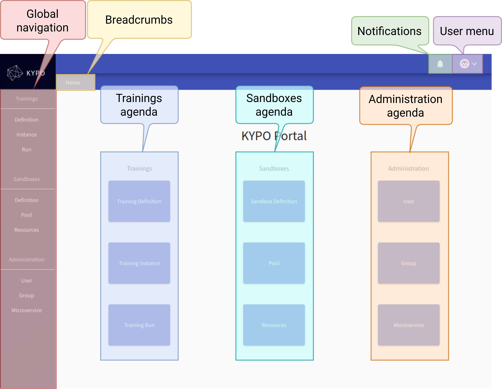

# KYPO User Guide

The objective of the **User guide** is to provide a basic guidelines to the users of the KYPO Portal. KYPO Portal is graphical user interface that mediates access to the platform for the end users by providing them with interactive visual tools. In particular, the portal is designed to cover the microservices that manage the different areas of the KYPO platform, e.g., user management, training management, access to sandboxes, etc.

The portal is divided into three **KYPO agendas** and user guide functions as a manual on how to operate all of the functions that these agendas offers.

## KYPO Portal page

**Global navigation:** A persistent navigation menu, displayed on all pages. Menu is divided based on the agendas and contain links to concrete pages.
**User menu:** User-specific information such as name and e-mail, and logout button.
**Breadcrumbs:** Full path to the current page. Represents the folder structure.
**Notifications:** The list of latest notifications.
**Agendas:** 

 1. [Trainings agenda](./training-agenda/training-agenda-overview.md) with main focus on creation and organization of trainings.
 2. [Sandboxes agenda](./sandbox-agenda/sandbox-agenda-overview.md) that specifies guide lines for sandbox creation and realization. 
 3. [Administration agenda](./administration-agenda/administration-agenda-overview.md) that deals with the administration of users and their access to the specific parts of the KYPO portal based on user access roles.
 
## Who can benefit from this section?

* **Training Designers** can find information about management of [Training definitions](./training-agenda/training-definition.md).
* **Training Organizers** can find information on how to manage [Training instances](./training-agenda/training-instance.md), [Sandbox pools](./sandbox-agenda/pool.md) and [Resources](./sandbox-agenda/resources.md) needed for Sandbox initialization.
* **Trainees** can look up the options they can perform inside of the [Traning run](./training-agenda/training-run.md).
* **Sandbox designers** can find out all about [Sandbox definitions](./sandbox-agenda/sandbox-definition.md).
* **User access administrators** can find out all about registered [Users](./administration-agenda/users.md), their user [Groups](./administration-agenda/groups.md) and [Microservices](./administration-agenda/microservices.md) of the KYPO portal.

