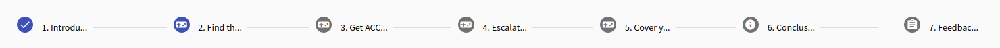
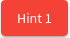
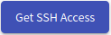

## Training Runs Overview
This page consists of two panels: 

1. [**Access Training**](#1-access-training)
2. [**Table with the list of training runs**](#2-table-with-the-list-of-training-runs) 

  

### 1. Access Training
Enter the access token prefix and PIN provided by the organizer of the training instance into the two fields shown in the above figure. By clicking on  the button the system checks if there are any active training instances with a corresponding access token and if there are any available sandboxes. If those conditions are fulfilled the trainee will access the training run (particular game) with an assigned unique sandbox.

!!! note
    If trainee already accessed training run in particular training instance and haven't finished it yet, the training run will be resumed. 

### 2. Table with the list of training runs
Lists all training runs of the logged-in trainee. Each row of the table represents a training run of a particular training instance (trainee can access multiple training runs within training instance). The training run can be unfinished or finished. An unfinished run can be resumed using the :material-launch:{: .blue .icon} button or entering the access token in the Access Training panel.   
A trainee can view the results of the finished training run by clicking the :material-poll-box:{: .blue .icon} button.  

## Training Run

In the training run, trainees will go through predesigned levels. In the current version, there are three types of level:

1. [**Assessment level**](#1-assessment-level)
2. [**Info level**](#2-info-level) 
3. [**Game level**](#3-game-level)

At the top of the training run page, there is a bar listing all of the levels in order. The finished levels are marked by :material-checkbox-marked-circle:{: .blue .icon}, the current level is highlighted in blue and the following levels are gray.

### 1. Assessment Level 
At the assessment level, a trainee must answer the different types of questions. Assessment can be a questionnaire or test. If it is a test, the trainee should try his best to get the best score, because questions are scored. Some of the questions can be required and must be answered to proceed to the next level. 

There are three types of questions: 

* **Free Form Question (FFQ)**: Trainees are asked to provide the text answer to the predefined field. 
* **Multiple Choice Questions (MCQ)**: Trainees are asked to select only correct answers from the choices offered as a list.
* **Extended matching item (EMI)**: Trainees are asked to pair items in row and column. 

  

### 2. Info Level
The info level is used to provide important information to trainees in text form.

  

### 3. Game Level 
At the game level, the trainee must complete the assignment specified on the left side of the page. On the right, side the sandbox topology is displayed. The layout of the topology can be changed with the controls panel(see the following figure):

  

#### VM manipulation
Right click on the selected network node (host or router), the following menu will be opened:

  

* **Generate console URL**: Connect to Spice console for a particular network node (this is provided by OpenStack cloud). When you will connect to the Spice you will see the following console in a new browser tab. If will provide a correct login and password combination, you will be able to work inside of the corresponding VM:

    

        
    

* **Resume**: Resuming a suspended virtual machine is analogous to waking up a computer that has been in sleep mode.
* **Reboot**: Rebooting a virtual machine is analogous to restarting a computer.
* **Suspend**: Suspending a virtual machine is analogous to putting a computer into sleep mode. 

#### Hints
In case the trainee gets stuck and does not know how to proceed with task, they can use one or more of the provided hints situated under the sandbox schema. Click the  button, the following confirmation window will be opened: 

   

The message inside the window contains the name of the hint which should tell the trainee if it will help them or not. The message also contains the number of points which will be lost if the trainee reveals the hint. 

#### Solution
If hints are not enough, the trainee can reveal the solution by clicking the . Solution reveal will cost the trainee all of the points that could be awarded at the given level.

#### SSH Access
In addition to connecting to the sandbox using Spice, it is also possible to connect to the sandbox machines locally using the SSH. To do that, click the  button and download the ZIP archive with the configuration of a user SSH access to the respective sandbox. More about SSH access can be found in [Sandbox SSH Access](/operator-guide/sandboxes/sandbox-ssh-access#user-access).

## Training Run Results

When the trainee finishes a training run, they will see the visualizations of them and the other player's behavior in the game:

  

